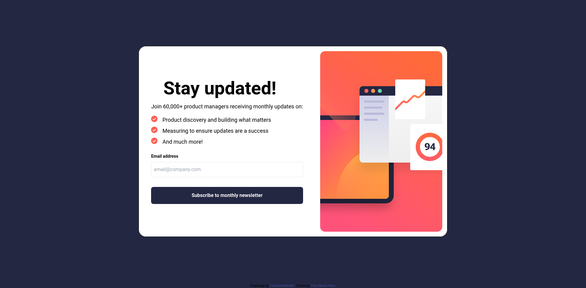

# Frontend Mentor - Newsletter sign-up form with success message solution

This is a solution to the [Newsletter sign-up form with success message challenge on Frontend Mentor](https://www.frontendmentor.io/challenges/newsletter-signup-form-with-success-message-3FC1AZbNrv). Frontend Mentor challenges help you improve your coding skills by building realistic projects. 

## Table of contents

- [Overview](#overview)
  - [The challenge](#the-challenge)
  - [Screenshot](#screenshot)
  - [Links](#links)
- [My process](#my-process)
  - [Built with](#built-with)
  - [What I learned](#what-i-learned)
  - [Continued development](#continued-development)
- [Author](#author)


## Overview

Built using Semantic HTML5 markup, tailwindcss, and ReactJS, this app was built to look like the design file pictures.  It is a responsive app, and works across all window sizes.


### The challenge

Users should be able to:

- Add their email and submit the form
- See a success message with their email after successfully submitting the form
- See form validation messages if:
  - The field is left empty
  - The email address is not formatted correctly
- View the optimal layout for the interface depending on their device's screen size
- See hover and focus states for all interactive elements on the page

### Screenshot




### Links

- Solution URL: [GitHub Code](https://github.com/rdpinkst/newsletter-sign-up-with-success-message-main)
- Live Site URL: [Live Site URL](https://rdpinkst.github.io/newsletter-sign-up-with-success-message-main/)

## My process
This app was built using React and tailwindcss.  To start the build process I had to figure out how to add both React and tailwindcss to this project.  I chose to use the unpkg versions.  I then decided to start with the SignupForm component.  I did all the jsx, and once the jsx was done, styling was then completed by adding the tailwindcss classes.  This process was then repeated with the SuccessSub component.  Once the two components were looking like the design files, I worked on the active state hover affects with the buttons.  The mobile design was the next challenge undertaken, adding max-[850px] queries to classes where needed in the component.  

### Built with

- Semantic HTML5 markup
- Tailwindcss
- [React](https://reactjs.org/) - JS library

### What I learned

In completing this project I learned about the picture tag in React.  The picture tag allows the browser to decide which illustration image to use based on the source tags media and size attribute, setting the src to the mobile illustration, and the default img being the desktop illustration.


```html
          <picture>
            <source className="w-full" 
              srcSet="./assets/images/illustration-sign-up-mobile.svg" 
              media="(max-width: 850px)"
              sizes="850px" />
            
          </picture>
```

## Author

- Frontend Mentor - [@rdpinkst](https://www.frontendmentor.io/profile/rdpinkst)

